# 多 Agent 管理平台 · 需求与设计文档

> **版本**：v1.0（2026-06-23）
> **定位**：平台级产品需求 + 系统设计（面向目标平台愿景，POC 作为首期里程碑）
> **读者**：管理/决策层（执行摘要、目标、价值、架构总览）+ 研发工程师（数据模型、接口、流程，见技术附录）

---

## 文档导读

| 我是… | 建议阅读 |
|-------|---------|
| 决策者 / 管理层 | 第 1 章执行摘要 → 第 2-3 章背景与目标 → 第 8 章架构总览 → 第 18 章路线图 |
| 产品 / PM | 第 4-7 章需求全部 → 第 13 章端到端流程 → 第 17 章风险 |
| 架构师 / 研发 | 第 8-16 章设计全部 → 附录 A-D 技术下钻 |
| 待我确认的问题 | 附录 E 开放问题清单 |

文档分两大部分：**第一部分（第 1-7 章）= 需求**，**第二部分（第 8-18 章）= 设计**，**附录 = 技术下钻与待确认项**。

---

# 第一部分 · 需求

## 1. 执行摘要

**多 Agent 管理平台** 是一个面向企业软件工程团队的 **多 AI Agent 编排与协作平台**。它将"项目—团队—成员"的真实组织结构映射为一套可观测、可治理的 AI Agent 体系：由一个系统级 **Super Admin Agent** 统筹全局，按项目自动组建 **Team**，Team 内由 **PM Agent** 编排多个 **Worker Agent**（开发、测试、Git、Jira 监控等）协同完成软件工程任务。

平台的核心价值是把"多个 AI agent 如何分工协作"从一次性脚本提升为**有生命周期管理、有人机协作回路、有完整可观测性、有权限治理**的工程化系统。

| 维度 | 内容 |
|------|------|
| **是什么** | 多 AI Agent 的编排、协作、生命周期管理与可观测平台 |
| **为谁** | 企业研发团队的管理者、PM、工程师；以及被编排的 AI Agent |
| **解决什么** | AI agent 各自为战、无统一编排、无生命周期、无审计、无人机协作回路的问题 |
| **首个旗舰场景** | 端到端"修 bug"：Jira 触发 → 多 agent 协同分析/修复/验证/提 PR → 阻塞时派 Todo 给人 |
| **能力边界** | 通用软件工程协作（修 bug 为首发；需求实现、重构、代码审查、测试为后续场景） |
| **差异化** | 三层 agent 模型 + 对齐 Google A2A 协议 + 人机协作 Todo 回路 + OpenTelemetry 全链路可观测 |

### 1.1 一句话价值主张

> 让一组 AI Agent 像一支真实的工程团队一样被组建、被指挥、被观测、被治理——并在卡住时无缝把任务交还给人。

### 1.2 平台能力全景（按业务价值）

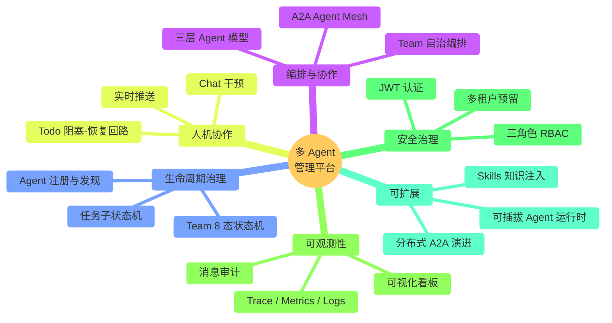

---

## 2. 背景与问题陈述

### 2.1 现状与痛点

AI coding agent（Claude Code、Copilot、各类 Agent SDK）能力快速提升，但在企业落地时暴露出系统性问题：

| 痛点 | 现状 | 影响 |
|------|------|------|
| **各自为战** | 每个 agent 单独调用，缺乏统一编排者 | 复杂任务需人工串联，无法自动分工 |
| **无生命周期** | agent 任务跑完即结束，无"待命—触发—工作—完成"状态 | 无法对接事件驱动场景（如 webhook 触发） |
| **无人机协作** | agent 卡住后无标准回路把任务交还给人 | 阻塞即失败，人无法顺畅介入与恢复 |
| **无审计可观测** | agent 间交互是黑盒，出问题难定位 | 无法治理、无法优化、无法追责 |
| **无组织映射** | agent 与真实"项目/团队"结构脱节 | 管理者无法用熟悉的组织视角管理 agent |
| **无权限治理** | 缺乏角色与权限模型 | 无法区分管理者、PM、普通用户的能力边界 |

### 2.2 为什么现在做

1. **A2A 协议收敛**：2025 年 Google 发布 A2A（Agent-to-Agent）开放协议，业界 agent 互通标准趋于统一，平台对齐标准的时机成熟。
2. **Agent SDK 成熟**：Agno 等 SDK 提供 Agent / Team / Toolkit / 多模式编排原语，无需自研底座。
3. **真实业务牵引**：固件/工具链团队（BMC、UEFI、TOOLS、LXCA、LXCE 等 component）有明确的"sustaining 修 bug"刚需，可作为首个旗舰场景验证平台。

### 2.3 范围声明

本平台定位为 **通用多 Agent 软件工程协作平台**。"修 bug"是用于验证端到端协作链路的**首个旗舰场景**，平台的 Agent 能力栈（代码理解/编写/重构/审查/测试/Bug 修复）从设计之初即覆盖完整软件工程能力，为后续承接"需求实现、技术债清理、代码审查"等场景铺路。

---

## 3. 目标与非目标

### 3.1 平台级目标（Goals）

| # | 目标 | 说明 |
|---|------|------|
| G1 | **三层 Agent 模型** | Super Admin（系统级）+ PM Agent（项目级）+ Worker Agent（功能级）的分层编排架构 |
| G2 | **标准对齐的 A2A 通信** | Agent Card / Task / Artifact 抽象对齐 Google A2A；支持同步/异步/流式三种通信模式 |
| G3 | **Team 生命周期管理** | 按项目自动组建 Team，8 态状态机覆盖 created → idle → working → completed/failed |
| G4 | **事件驱动触发** | 外部系统（Jira/Git）通过 webhook 触发 Team 工作，含签名校验、幂等去重、路由 |
| G5 | **人机协作回路** | Agent 创建 Todo 阻塞流程 → 实时推送给用户 → 用户处理后恢复执行 |
| G6 | **完整开发能力栈 Worker** | Dev / Test / Fixbug / Git / Jira-Monitor / PA-Tester 等通用 worker，覆盖完整工程能力 |
| G7 | **认证与 RBAC** | JWT 认证 + admin/pm/user 三角色权限治理 + 差异化前端视图 |
| G8 | **全链路可观测** | OpenTelemetry trace + metrics + logs 关联 trace_id，可视化看板 |
| G9 | **实时协作 UI** | WebSocket 推送 Team 状态、任务进度、Todo、Agent 状态变化 |
| G10 | **可扩展架构** | 可插拔 agent 运行时、分布式 A2A 演进、多租户、知识库（RAG）均有预留 |

### 3.2 非目标（Non-Goals，平台首期不做）

| # | 非目标 | 推迟到 |
|---|--------|--------|
| NG1 | 复杂条件分支 workflow DAG | 编排首期固定流程（Dev→Test→Git），DAG 后续 |
| NG2 | 执行中 agent 热替换 | 首期仅 pause/resume/cancel/retry |
| NG3 | RAG / 向量知识库 | pgvector 预留，后续启用 |
| NG4 | 跨 workspace 协作授权 | 多租户字段预留，首期单 workspace |
| NG5 | agent 自主学习/微调 | 平台不做模型训练，仅编排 |

### 3.3 POC 首期里程碑的收窄

> 平台愿景是通用的，但**首期（POC）刻意收窄到一个可演示、可重复的"修 bug"端到端流程**，以最小成本验证三层模型、A2A 协作、生命周期、人机回路、可观测性这五大支柱。POC 与平台目标的差异详见第 18 章演进路线图。

---

## 4. 干系人与角色

### 4.1 人类角色（RBAC）

| 角色 | 画像 | 核心诉求 | 关键操作 |
|------|------|---------|---------|
| **admin** | 平台管理员 | 系统治理、用户管理、全局监控 | 用户增删、全局看板、取消任意 Team |
| **pm** | 项目经理 | 项目交付、团队效能 | 导入项目、查看 Teams、处理 Todo、查看 Metrics/Trace |
| **user** | 普通工程师 | 完成派给自己的协作任务 | 处理自己的 Todo、查看参与 Team、与 agent Chat |

### 4.2 Agent 角色

| Agent 角色 | 层级 | 职责 | 实例化方式 |
|-----------|------|------|-----------|
| **Super Admin Agent** | 系统级 | 监控系统、按项目建 Team、分配成员、兜底失败 | 平台启动时单例 |
| **PM Agent** | 项目级 | Team 内编排（Dev→Test→Git）、处理失败、创建 Todo | 随 Team 创建 |
| **Worker Agent** | 功能级 | 执行具体能力（开发/测试/Git/监控等） | 按 scope/能力注册 |

### 4.3 干系人交互全景

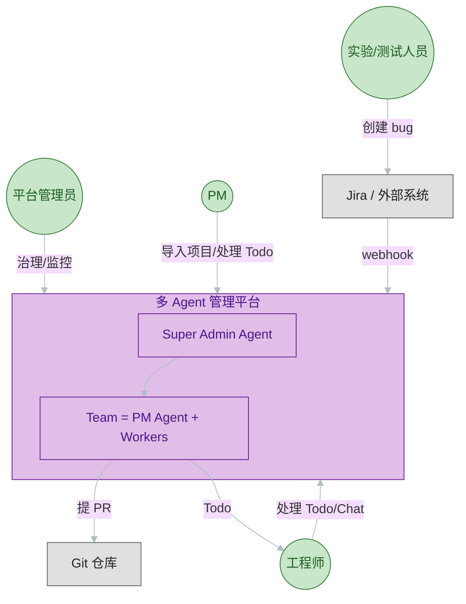

---

## 5. 用户故事与核心场景

### 5.1 旗舰场景：端到端修 bug

> 实验人员在 Jira 创建 bug → webhook 触发 → Team 内 Dev/Test/Git agent 协同分析、修复、验证、提交 PR → 如遇阻塞，派 Todo 给人处理后继续。

```mermaid
%%{init: {'theme': 'base', 'themeVariables': {'lineColor': '#B0BEC5'}}}%%
flowchart LR
    A[实验人员<br/>创建 Jira bug] --> B[webhook 触发<br/>签名校验/去重/路由]
    B --> C[Team 被唤醒<br/>idle → working]
    C --> D[Dev Agent<br/>分析根因/生成补丁]
    D --> E[Test Agent<br/>验证/覆盖率]
    E --> F{通过?}
    F -->|是| G[Git Agent<br/>提交 PR]
    F -->|否/阻塞| H[创建 Todo<br/>派给 PM/工程师]
    H --> I[人处理后恢复]
    I --> G
    G --> J[Team completed<br/>实时推送结果]

    classDef start fill:#C8E6C9,stroke:#2E7D32,color:#1B5E20
    classDef work fill:#FFECB3,stroke:#FF8F00,color:#FF6F00
    classDef human fill:#BBDEFB,stroke:#1976D2,color:#0D47A1
    classDef done fill:#E1BEE7,stroke:#6A1B9A,color:#4A148C

    class A,B start
    class C,D,E,F,G work
    class H,I human
    class J done
```

### 5.2 用户故事清单

| ID | 角色 | 用户故事 | 优先级 |
|----|------|---------|--------|
| US1 | PM | 作为 PM，我希望上传项目 CSV，让平台自动按 scope 组建 Team 并待命，这样我无需手动配置 agent | P0 |
| US2 | 系统 | 作为平台，我希望接收 Jira webhook 并路由到对应 Team，触发 bug 处理流程 | P0 |
| US3 | PM Agent | 作为 PM Agent，我希望编排 Dev→Test→Git 流程，自动完成 bug 修复并提 PR | P0 |
| US4 | 工程师 | 作为工程师，当 agent 卡住时，我希望收到 Todo 并在处理后让流程自动恢复 | P0 |
| US5 | 工程师 | 作为工程师，我希望实时看到各 agent 的状态与进度 | P1 |
| US6 | PM | 作为 PM，我希望看到跨 Team 的效能指标与可下钻的 trace | P1 |
| US7 | 工程师 | 作为工程师，我希望与某个 agent Chat，给它补充上下文或纠偏 | P1 |
| US8 | admin | 作为管理员，我希望管理用户、监控系统健康、在必要时取消 Team | P1 |
| US9 | PM | 作为 PM，未来我希望同一套 Team 不仅能修 bug，还能承接需求实现/重构 | P2 |

### 5.3 其他平台场景（能力扩展方向）

| 场景 | 复用的能力 | 状态 |
|------|-----------|------|
| 需求实现 | Dev Agent 的 write_code / generate_patch + Test + Git | P2（能力栈已设计，流程后续） |
| 代码审查 | Dev Agent 的 review_pull_request / check_style | P2 |
| 技术债清理/重构 | Dev Agent 的 refactor_code / optimize_code | P2 |
| 定时 PA 测试 | PA-Tester Agent 按 schedule 触发 | P1 |

---

## 6. 功能需求（FR）

> 优先级：**P0** = POC 首期必须；**P1** = 平台首版；**P2** = 后续演进。

### 6.1 项目与 Team 管理

| ID | 功能需求 | 优先级 |
|----|---------|--------|
| FR-1.1 | 支持 PM 通过 CSV 导入项目（name、schedule、scope） | P0 |
| FR-1.2 | 解析 CSV 并校验，落库为 project，触发 `project.created` 事件 | P0 |
| FR-1.3 | Super Admin 订阅事件，按 project.scope 自动选 worker、组建 Team | P0 |
| FR-1.4 | Team 创建后自动进入 idle 待命状态 | P0 |
| FR-1.5 | 一个项目对应唯一一个 Team（一对一） | P0 |
| FR-1.6 | 支持 admin/pm 取消 Team | P1 |

### 6.2 Agent 编排与 A2A

| ID | 功能需求 | 优先级 |
|----|---------|--------|
| FR-2.1 | 提供 Agent Registry，支持启动时 YAML bootstrap + 运行时注册 | P0 |
| FR-2.2 | 提供 Agent Card 能力描述（name/type/capabilities/scope/schema/status） | P0 |
| FR-2.3 | EventBus 支持 publish / subscribe / request / stream / broadcast | P0 |
| FR-2.4 | PM Agent 编排 Dev→Test→Fixbug→Git 流程 | P0 |
| FR-2.5 | 所有 A2A 消息落库审计（含 trace_id） | P0 |
| FR-2.6 | A2A 抽象对齐 Google A2A（Agent Card / Task / Artifact） | P1 |
| FR-2.7 | 支持跨进程 A2A（HTTP/JSON-RPC）与服务发现 | P2 |

### 6.3 事件触发与 Webhook

| ID | 功能需求 | 优先级 |
|----|---------|--------|
| FR-3.1 | 接收 Jira webhook，HMAC-SHA256 签名校验 | P0 |
| FR-3.2 | webhook 幂等去重（source + external_id 唯一） | P0 |
| FR-3.3 | 按 project key 路由 webhook 到对应 Team | P0 |
| FR-3.4 | 创建 bug_task 并驱动子状态机（received→…→completed） | P0 |
| FR-3.5 | 支持 GitHub/GitLab webhook 扩展 | P2 |
| FR-3.6 | bug 完成后回写外部系统状态 | P2 |

### 6.4 人机协作（Todo）

| ID | 功能需求 | 优先级 |
|----|---------|--------|
| FR-4.1 | Agent 可创建 Todo 阻塞流程，Team 进入 awaiting_human | P0 |
| FR-4.2 | Todo 实时推送到目标用户 inbox | P0 |
| FR-4.3 | 用户 resolve Todo 后触发 Team 从 awaiting_human 恢复 | P0 |
| FR-4.4 | Todo 支持指派、未指派由 Super Admin 决策派发 | P1 |
| FR-4.5 | Todo 关联资源（PR url、文件路径）与历史记录 | P1 |

### 6.5 Worker Agent 能力

| ID | 功能需求 | 优先级 |
|----|---------|--------|
| FR-5.1 | Dev Agent 具备完整开发能力栈（理解/编写/重构/审查/测试/修 bug） | P0 |
| FR-5.2 | 每个 component（BMC/UEFI/TOOLS/…）一个专业化 Dev Agent | P0 |
| FR-5.3 | 共享 Worker：Test / Fixbug / Git-Operator / Jira-Monitor / PA-Tester | P0 |
| FR-5.4 | Worker 行为通过 Skills（领域知识）注入专业化 | P1 |
| FR-5.5 | 支持可插拔运行时：Agno 原生 agent 与 CLI agent（Claude Code/Copilot）共存 | P2 |

### 6.6 实时与 UI

| ID | 功能需求 | 优先级 |
|----|---------|--------|
| FR-6.1 | WebSocket 房间模型，按实体（Team/用户）订阅 | P0 |
| FR-6.2 | 推送 Team 状态、bug 进度、Todo、agent 状态变化 | P0 |
| FR-6.3 | 普通用户视图：Todo + Agent Status + Chat | P0 |
| FR-6.4 | PM 视图：+ 项目导入 + Teams 总览 + Metrics + Trace | P1 |
| FR-6.5 | 与 agent Chat（流式回包） | P1 |

### 6.7 安全与治理

| ID | 功能需求 | 优先级 |
|----|---------|--------|
| FR-7.1 | JWT 认证（user_id + role + workspace + exp） | P0 |
| FR-7.2 | admin/pm/user 三角色 RBAC 权限矩阵 | P0 |
| FR-7.3 | webhook 签名校验 | P0 |
| FR-7.4 | 多租户 workspace 隔离 | P2 |

### 6.8 可观测性

| ID | 功能需求 | 优先级 |
|----|---------|--------|
| FR-8.1 | OpenTelemetry trace + metrics + logs，关联 trace_id | P0 |
| FR-8.2 | 关键 span：agent.invoke / a2a.request / team.transition / webhook.handle | P0 |
| FR-8.3 | Grafana 看板（System Overview / Agent Performance / A2A Traffic） | P1 |
| FR-8.4 | Jaeger trace 可视化 + 日志跳转 | P1 |

---

## 7. 非功能需求（NFR）

| 类别 | ID | 需求 | 指标 / 验收 |
|------|----|------|------------|
| **性能** | NFR-P1 | A2A 进程内调用延迟低 | 进程内 request 近零延迟；publish 毫秒级 |
| | NFR-P2 | 平台支撑的并发规模（首期单进程） | < 50 并发 Team、< 200 并发 agent 调用为安全区 |
| | NFR-P3 | API p95 延迟可控 | 监控 p50/p95，超阈值告警 |
| **可观测** | NFR-O1 | 全链路可追溯 | 每条 A2A 消息、状态转换、tool 调用有 trace |
| | NFR-O2 | 审计完整 | 所有 agent 消息落库，可按 trace_id 检索 |
| **安全** | NFR-S1 | 认证与授权 | JWT + RBAC，受保护接口按角色校验 |
| | NFR-S2 | webhook 防伪 | HMAC-SHA256 签名校验，常量时间比较 |
| | NFR-S3 | 密钥不硬编码 | 通过环境变量注入（API key、webhook secret） |
| **可扩展** | NFR-E1 | A2A 接口稳定 | 进程内 → 分布式升级时调用方代码不变 |
| | NFR-E2 | Agent 运行时可插拔 | mock/Agno/CLI 切换边界在 Toolkit/Adapter 内部 |
| | NFR-E3 | 多租户预留 | 所有业务表含 workspace_id |
| **可用性** | NFR-A1 | 状态机非法转换防护 | 非法转换抛异常并审计 |
| | NFR-A2 | 失败兜底 | Team failed 由 Super Admin 生成复盘 Todo |
| **可维护** | NFR-M1 | Agno SDK 调用集中封装 | 业务层不直接依赖 SDK 内部 API |
| | NFR-M2 | 测试质量门槛 | 核心模块覆盖率有门槛（见附录 D） |

---

# 第二部分 · 设计

## 8. 系统架构总览

### 8.1 分层架构

平台分为四层：**前端层、控制平面、Agent 运行时、数据平面**。

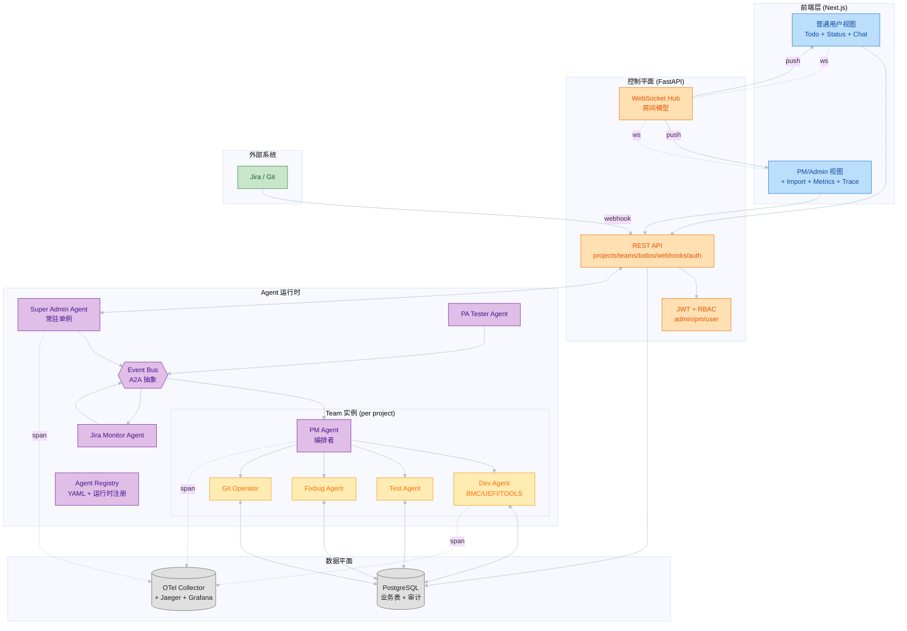

### 8.2 各层职责

| 层 | 职责 | 技术选型 |
|----|------|---------|
| **前端层** | 用户交互、实时状态展示、角色差异化 UI | Next.js + React + TanStack Query + Zustand + shadcn/ui |
| **控制平面** | REST API、WebSocket、认证、webhook 入口、持久化 | FastAPI + Pydantic + SQLAlchemy 2.x async + Alembic |
| **Agent 运行时** | Agent 执行、Team 编排、A2A 通信、流程协调 | Agno SDK + 自研 EventBus + Agent Registry |
| **数据平面** | 业务数据、A2A 审计、遥测数据 | PostgreSQL + OpenTelemetry + Jaeger + Grafana |

### 8.3 目标架构：从单进程到分布式

> **关键设计立场**：平台的**目标架构是跨进程/分布式 A2A**（基于 HTTP/JSON-RPC，对接标准 A2A endpoint）。**进程内 A2A（单 FastAPI 进程）是 POC 首期的实现**，用于在零网络开销下快速验证协作机制。两者共享同一套 EventBus 接口与 Agent Card / Task / Artifact 抽象，升级时**调用方代码不变，仅替换 EventBus 实现**。

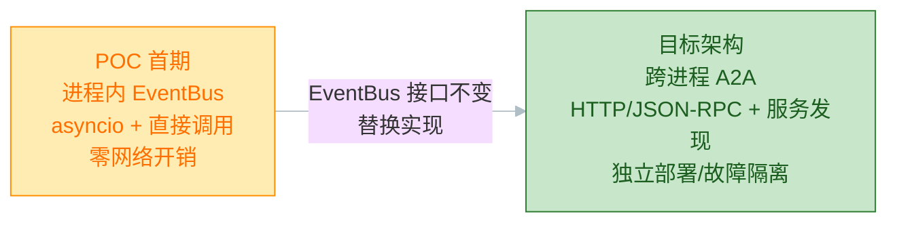

### 8.4 部署拓扑（首期 Docker Compose）

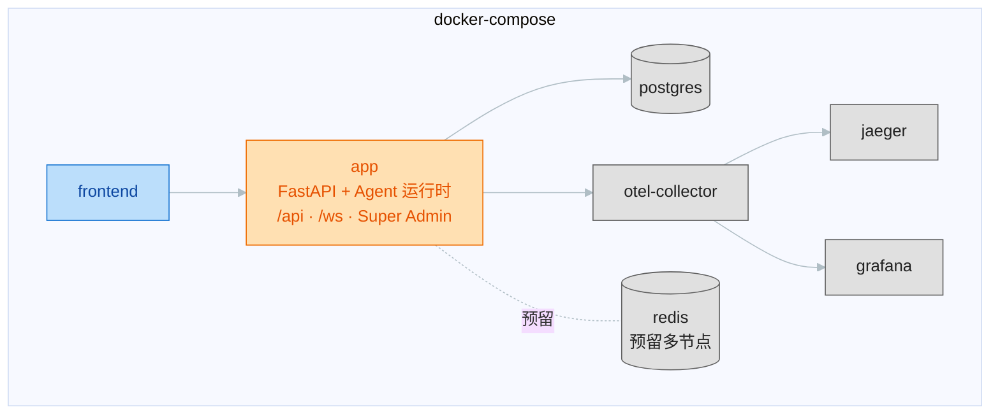

---

## 9. 三层 Agent 模型

### 9.1 层次关系（Team 按项目组织）

**核心概念**：Team 以**项目**为单位组织（而非以 component 为单位）。一个项目（如 "sustaining-2026-03"）对应一个 Team。每个 Team 内部包含：
- 各 **component 组**的 Dev Agent（BMC、UEFI、TOOLS、LXCA、LXCE，按 project.scope 选取）
- **全 Team 共享**的通用 agent（Test、Fixbug、Git-Operator）
- 一个 **PM Agent** 作为 Team 内协调者

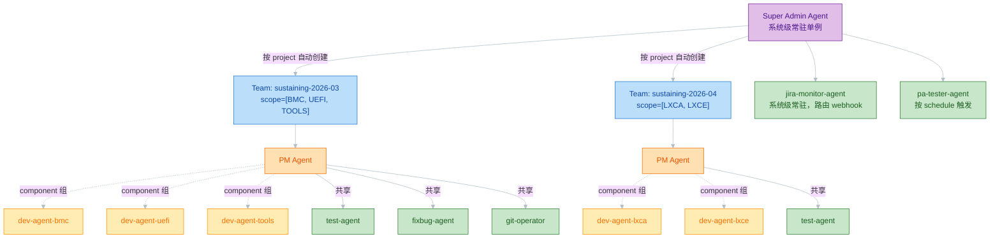

### 9.2 三类 Agent 职责对比

| 维度 | Super Admin Agent | PM Agent | Worker Agent |
|------|------------------|----------|-------------|
| **层级** | 系统级 | 项目级 | 功能级 |
| **数量** | 单例 | 每 Team 一个 | 按 scope/能力多个 |
| **核心职责** | 监控系统、建 Team、分配成员、兜底失败 | Team 内流程编排、失败处理、创建 Todo | 执行具体能力 |
| **触发** | `project.created` 事件、周期监控 | `bug.triggered` 事件 | PM Agent 的 A2A 请求 |
| **生命周期** | 进程生命周期内常驻 | 随 Team 创建/归档 | 注册后常驻待命 |
| **是否用 LLM** | 是（编排决策） | 是（编排决策） | 是（能力执行；首期 tools 为 mock） |

### 9.3 Worker Agent 分类

#### 9.3.1 Component 组 Dev Agents（按 project.scope 选取）

每个 component 对应一个**通用项目组开发 agent**，具备**完整开发能力栈**，不局限于 bug 修复。所有 component 共享同一套工具集，差异通过 `scope_affinity` + 注入的 Skills + 领域数据体现。

| 能力分类 | 工具集 | 说明 |
|---------|-------|------|
| 代码理解 | `analyze_code`、`search_code`、`explain_module`、`read_file` | 阅读/定位/解释 |
| 代码编写 | `write_code`、`generate_patch`、`edit_file` | 实现/补丁/增量编辑 |
| 重构优化 | `refactor_code`、`optimize_code`、`extract_function` | 提取/去重/性能 |
| 代码审查 | `review_pull_request`、`check_style`、`identify_smells` | PR review/风格/坏味道 |
| 测试编写 | `write_tests`、`generate_test_cases` | 单测/用例 |
| Bug 修复 | `analyze_bug_log`、`locate_root_cause`、`reproduce_bug` | 日志/根因/复现 |

| Agent | scope_affinity | 注入 Skills | 说明 |
|-------|---------------|------------|------|
| dev-agent-bmc | [BMC] | bmc-firmware / bmc-arch | BMC 项目组开发 agent |
| dev-agent-uefi | [UEFI] | uefi-boot-flow / uefi-driver | UEFI 项目组开发 agent |
| dev-agent-tools | [TOOLS] | tools-arch / testing-methodology | 工具链项目组开发 agent |
| dev-agent-lxca | [LXCA] | lxca-service / rest-api-pattern | LXCA 项目组（预留） |
| dev-agent-lxce | [LXCE] | lxce-firmware / lxce-debug | LXCE 项目组（预留） |

#### 9.3.2 共享通用 Agents（每个 Team 都加入）

| Agent | type | 能力 | 说明 |
|-------|------|------|------|
| test-agent | test | run_unit_tests / run_integration_tests / measure_coverage | 测试执行与覆盖率 |
| fixbug-agent | fixbug | apply_patch / resolve_conflicts / rebase_branch | 补丁应用、冲突解决 |
| jira-monitor-agent | jira_monitor | parse_jira_event / route_to_team / update_jira_status | Jira 入口 + 回写（系统级常驻） |
| git-operator-agent | git_operator | clone / branch / commit / push / open_pr / merge_pr | Git 全流程 |
| pa-tester-agent | pa_tester | run_pa_suite / compare_with_baseline / generate_pa_report | PA 测试（按 schedule） |

> jira-monitor 与 pa-tester 是**系统级常驻**，不挂在单个 Team 下，而是按 webhook / schedule 路由到对应 Team。

### 9.4 LLM 接入（可配置）

平台所有 agent 的编排/能力决策通过 **Agno `OpenAILike` 抽象**接入 LLM，**接入点可配置**，支持两种部署形态切换：

| 形态 | Base URL 示例 | 适用 |
|------|--------------|------|
| 内网自部署 OpenAI 兼容端点 | `http://internal-llm:8000/v1` | 内网隔离环境、低延迟 |
| DashScope 云端兼容端点 | `https://coding.dashscope.aliyuncs.com/apps/anthropic` | 快速接入、托管运维 |

| 配置项 | 说明 |
|--------|------|
| 模型 | 可配置（如 qwen3.7-plus），通过 `LLM_MODEL_NAME` 注入 |
| Base URL | 通过 `LLM_BASE_URL` 注入，二者择一 |
| API Key | 通过 `LLM_API_KEY` 环境变量注入（不硬编码） |
| Provider | `OpenAILike`，兼容任何 OpenAI schema endpoint |

> 所有 agent 经统一 `AgentFactory` 注入 LLM，切换接入点只改环境变量，不改业务代码。详见附录 E 开放问题（待确认默认接入点）。

---

## 10. A2A 通信架构

### 10.1 业界对齐策略

平台 A2A 抽象**完全对齐 Google A2A 标准**（2025 年发布，业界主流跨 agent 通信标准）：

| A2A 标准概念 | 说明 | 平台对应 |
|-------------|------|---------|
| **Agent Card** | 描述 agent 能力、端点、身份的 JSON | `AgentCard`（name/capabilities/schema/status） |
| **Task** | client → remote agent 的工作请求 | `AgentMessage`（含 task_id、payload） |
| **Artifact** | 任务产生的内容 | `AgentResponse.payload` |
| **JSON-RPC 2.0 over HTTP(S)** | 标准传输 | 目标架构采用；POC 用进程内 asyncio 变体 |
| **Streaming (SSE)** | 长任务流式 | `EventBus.stream`（async generator） |

**与 MCP 的关系**：MCP（Anthropic）解决 **agent ↔ tool** 通信；A2A（Google）解决 **agent ↔ agent** 通信。二者互补，平台同时遵循：Toolkit 遵循 MCP 思路，EventBus 遵循 A2A 思路。

### 10.2 三种通信模式

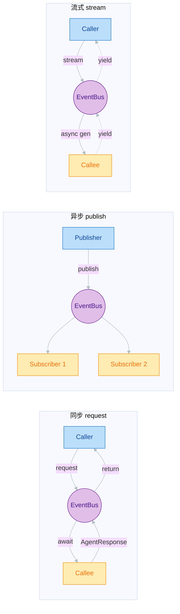

### 10.3 路由规则

| 模式 | 路由方式 | 延迟 | 适用 |
|------|---------|------|------|
| `request(to_agent, payload)` | 从 Registry 取实例直接调用（进程内）/ HTTP（分布式） | 近零 / 网络级 | PM → Dev 同步调用 |
| `publish(topic, message)` | 按 topic 分发到订阅者 | 毫秒级 | 状态变化通知 |
| `stream(to_agent, payload)` | async generator | 实时 | 流式输出、长任务进度 |
| `broadcast(topic, payload)` | publish 特例，无指定接收方 | 毫秒级 | 系统级广播 |

### 10.4 消息信封与能力卡（结构概览）

| 结构 | 关键字段 | 用途 |
|------|---------|------|
| **AgentMessage** | id、from_agent、to_agent、message_type、topic、payload、team_id、bug_task_id、trace_id | A2A 消息封套（对齐 A2A Task） |
| **AgentCard** | name、type、capabilities、scope_affinity、input/output schema、status、is_system | 能力描述（对齐 A2A Agent Card） |
| **AgentResponse** | status、payload、error_class | 任务结果（对齐 A2A Artifact） |

> 完整字段定义见附录 A。

---

## 11. Team 生命周期状态机

### 11.1 状态图

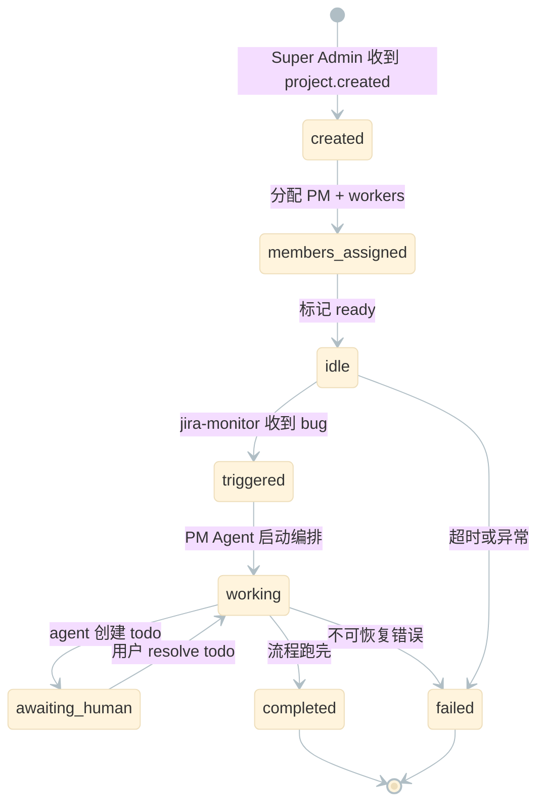

### 11.2 状态定义

| 状态 | 含义 | 触发条件 | 退出条件 |
|------|------|---------|---------|
| `created` | 刚创建，未分配成员 | Super Admin `create_team` | 成员分配完成 |
| `members_assigned` | 成员已分配，未启动 | `assign_members` 完成 | 进入 idle |
| `idle` | 等待外部事件 | `mark_idle` | 收到 bug.triggered |
| `triggered` | 收到 bug，未开始 | jira-monitor `trigger` | PM Agent `start_working` |
| `working` | agents 协同中 | `start_working` | 完成/创建 todo/失败 |
| `awaiting_human` | 被 todo 阻塞 | PM Agent `await_human` | 用户 resolve |
| `completed` | 成功完成 | `complete` | 终态 |
| `failed` | 不可恢复失败 | `fail` | 终态（可手动重启） |

### 11.3 合法转换表

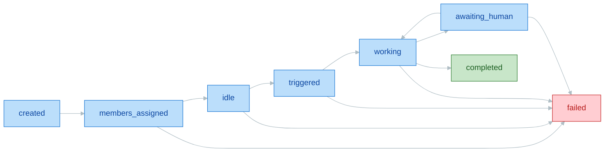

> 非法转换由 `TeamLifecycleManager` 内部 transition table 校验，抛 `InvalidTeamTransition` 异常并审计。

### 11.4 Bug Task 子状态机

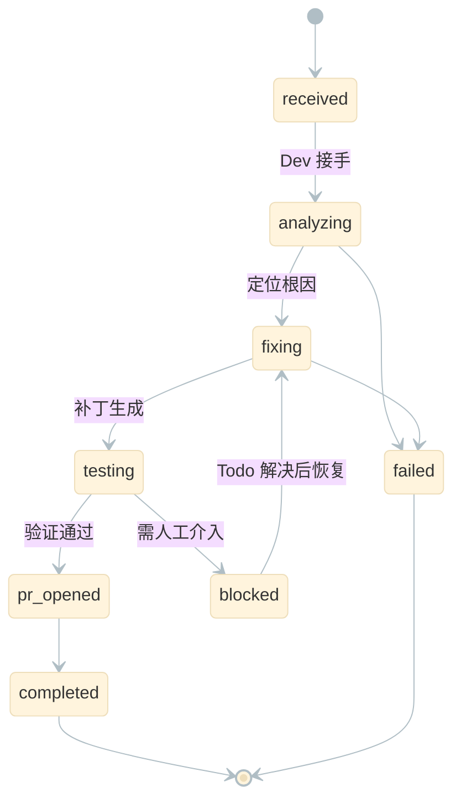

---

## 12. 数据模型

### 12.1 ER 关系图

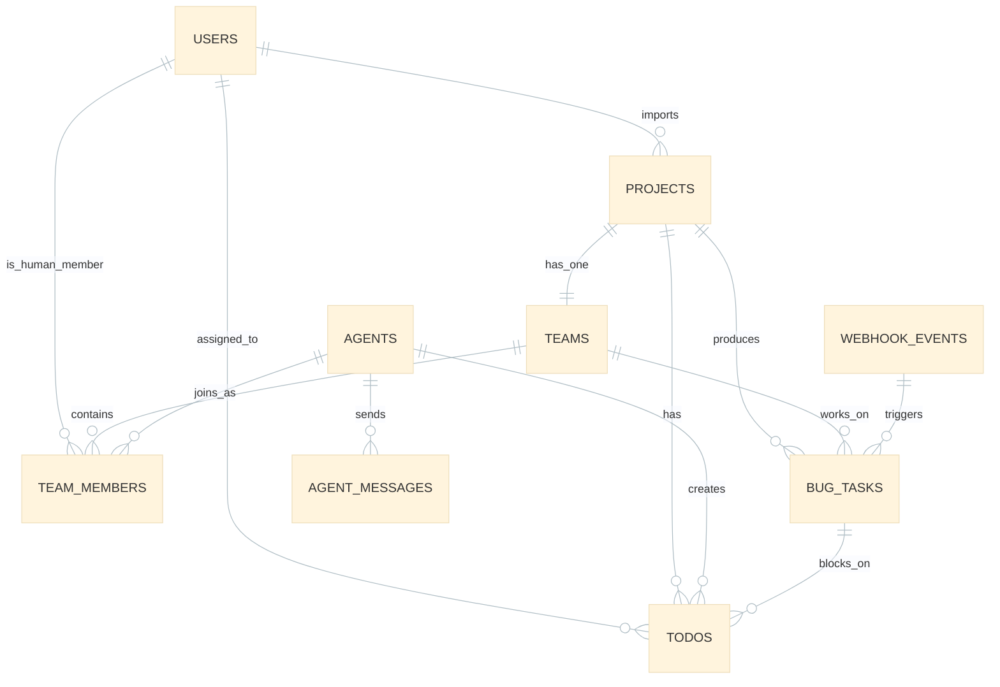

### 12.2 核心表概览

| 表 | 职责 | 关键字段 | 关键约束/索引 |
|----|------|---------|--------------|
| **users** | 用户与角色 | role(admin/pm/user)、jira_user_id、workspace_id | email 唯一 |
| **projects** | 导入的项目 | scope(JSONB)、schedule、status、team_id | scope GIN 索引 |
| **teams** | 项目对应的 Team | status(8 态)、mode、idle_since、agno_session_id | project_id 唯一；status/idle_since 索引 |
| **team_members** | Team 成员（agent/human） | member_type、agent_id/user_id、role(pm/worker) | (team_id, agent_id) 唯一 |
| **agents** | Agent 注册表 | type、capabilities、scope_affinity、status、is_system | name 唯一；capabilities/scope GIN |
| **todos** | 人机协作任务 | assigned_to_user_id、status、bug_task_id、related_resource | (assigned_to, status) 索引（inbox 热点） |
| **bug_tasks** | bug 修复任务 | status(子状态机)、current_step、current_agent_id、pr_url | (team_id, status) 索引 |
| **webhook_events** | 外部事件入口 | source、external_id、processing_status、routed_to_team_id | (source, external_id) 唯一（幂等） |
| **agent_messages** | A2A 审计 | from/to_agent_id、message_type、topic、payload、trace_id | trace_id/topic/team 索引 |
| **audit_log** | 运维审计（可选） | actor、action、target、trace_id | — |

### 12.3 索引设计原则

| 原则 | 说明 |
|------|------|
| 查询热点优先 | 用户 inbox（todos by assigned_to+status）、Team 监控（teams by status+idle_since）、webhook 去重（source+external_id）均覆盖 |
| JSONB GIN | scope、capabilities、scope_affinity 三处数组包含查询建 GIN |
| 避免过度索引 | agent_messages 为高写入审计表，只建必要索引，明细查询走 trace_id |
| 演进预留 | pgvector 预留（后续 `ALTER TABLE agents ADD COLUMN embedding`）；所有表含 workspace_id |

> 完整字段定义（类型/约束）见附录 A。

---

## 13. 端到端流程

### 13.1 流程一：导入项目 → 自动建 Team

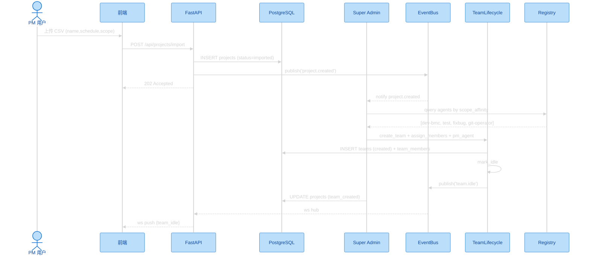

### 13.2 流程二：Jira webhook → Team 协同修 bug

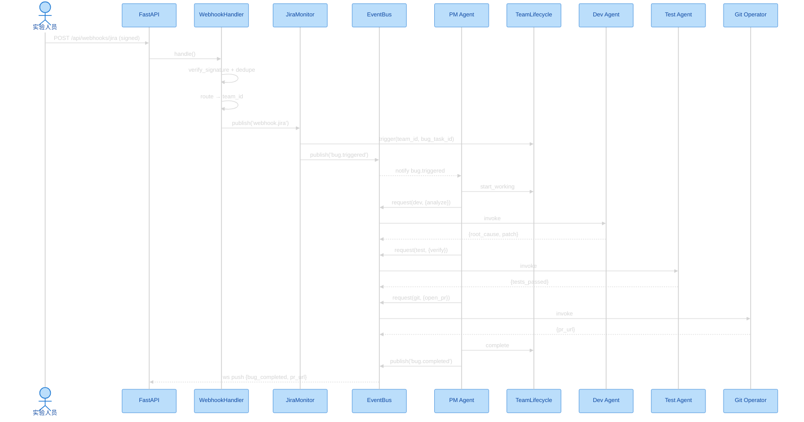

### 13.3 流程三：Todo 阻塞 → 人处理 → 恢复

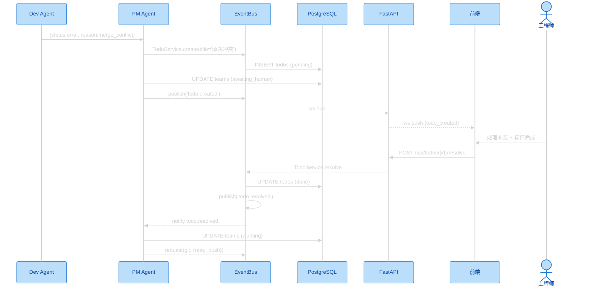

---

## 14. 核心接口职责

> 以下为关键抽象的**职责契约**（方法签名细节见附录 A）。平台业务层只依赖这些接口，不直接耦合 Agno SDK 内部。

### 14.1 Super Admin Agent

| 方法 | 职责 |
|------|------|
| `on_project_created` | 订阅事件，解析 scope，建 Team + 分配 agents（幂等） |
| `create_team_for_project` | 按 project 选 worker，调 TeamLifecycle 建团 |
| `select_agents_for_project` | 按 scope 选 dev agents + 共享 agents |
| `monitor_system_health` | 周期扫描 idle 过长/error agent，生成 todo/告警 |
| `handle_team_failure` | Team failed 兜底：记录、通知 PM、生成复盘 todo |

### 14.2 PM Agent

| 方法 | 职责 |
|------|------|
| `on_bug_triggered` | 订阅 bug.triggered，编排修复流程 |
| `orchestrate_fix_flow` | 核心编排循环：Dev→Test→Fixbug→Git，遇阻塞创建 Todo |
| `delegate_to_worker` | 通过 EventBus 同步调用 worker |
| `create_todo` | 创建 Todo 阻塞流程 |
| `resume_after_todo` | Todo resolve 后恢复执行 |

### 14.3 Worker Agent（基类）

| 方法 | 职责 |
|------|------|
| `agent_card` | 暴露能力描述卡 |
| `handle_message` | 处理 A2A 消息，委托 Agno Agent 执行 |
| `build_agno_agent` | 构造 Agno Agent（model + tools + instructions） |
| `publish_event` | 向 EventBus 发布异步事件 |
| `update_status` | 更新 status，触发 WebSocket 推送 |

### 14.4 平台服务接口

| 接口 | 核心方法 | 职责 |
|------|---------|------|
| **TeamLifecycleManager** | create_team / assign_members / mark_idle / trigger / start_working / await_human / resume / complete / fail | Team 状态机，所有转换走此处保证审计与推送 |
| **WebhookHandler** | verify_signature / dedupe / parse / route / handle | webhook 编排：校验→去重→解析→落库→路由→触发 |
| **TodoService** | create / assign / list_for_user / resolve | Todo 生命周期，resolve 触发 Team 恢复 |
| **EventBus** | publish / subscribe / request / stream / broadcast / persist | A2A 通信总线，所有消息落审计表 |

---

## 15. 可观测性、安全与 RBAC

### 15.1 可观测性三合一

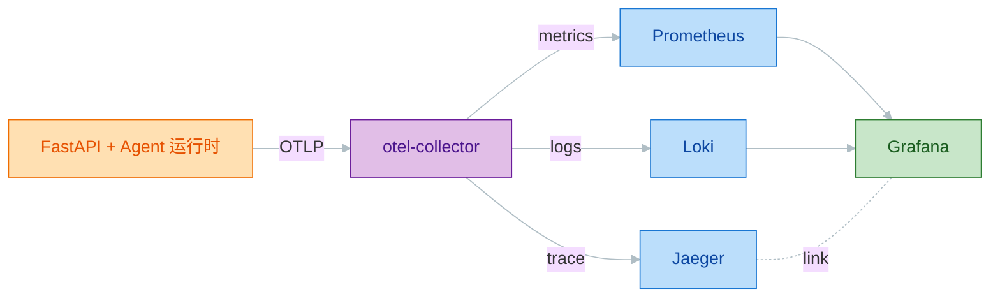

| 信号 | 关键内容 |
|------|---------|
| **Trace** | agent.invoke / a2a.request / team.transition / tool.execute / webhook.handle / todo.lifecycle |
| **Metrics** | agent_invocations_total、a2a_messages_total、team_state_transitions_total、bugs_resolved_total、token_usage_total、active_teams |
| **Logs** | 结构化 JSON，每条携带 trace_id + span_id，可在 Jaeger 跳转 |
| **看板** | System Overview / Agent Performance / A2A Traffic |

### 15.2 RBAC 权限矩阵

| 资源 / 操作 | admin | pm | user |
|------------|-------|-----|------|
| 导入项目（CSV） | ✓ | ✓ | ✗ |
| 查看 Teams Overview | ✓ | ✓ | 仅参与的 |
| 查看 Agent Status | ✓ | ✓ | ✓（只读） |
| 处理 Todo | ✓ | ✓ | 仅派给自己的 |
| 查看 Metrics / Trace | ✓ | ✓ | ✗ |
| 创建/删除用户 | ✓ | ✗ | ✗ |
| 取消 Team | ✓ | ✓（自己导入的） | ✗ |
| 与 agent Chat | ✓ | ✓ | ✓（参与的 Team 内） |

### 15.3 安全要点

| 维度 | 措施 |
|------|------|
| 认证 | JWT 携带 user_id + role + workspace_id + exp；FastAPI 依赖注入解析 |
| 授权 | 受保护接口按 role 校验权限矩阵 |
| Webhook 防伪 | HMAC-SHA256 签名 + 常量时间比较（`hmac.compare_digest`） |
| 密钥管理 | API key / webhook secret 经环境变量注入，不硬编码 |
| 多租户预留 | 所有业务表含 workspace_id，首期 default 单租户 |

---

## 16. 关键设计决策

> 下表为对平台架构影响最大的核心决策。

| # | 决策 | 选择 | 理由 |
|---|------|------|------|
| D1 | 后端语言 | Python 3.12 + FastAPI | Agno SDK 原生 Python；LLM/agent 生态最完整 |
| D2 | Agent 框架 | Agno SDK（Agent + Team + Toolkit） | 提供编排原语，省自研框架 |
| D3 | A2A 通信 | 抽象对齐 Google A2A；目标分布式（HTTP/JSON-RPC），首期进程内 | 标准对齐 + 首期零网络开销 |
| D4 | Agent 运行时 | 可插拔：Agno 原生 agent 与 CLI agent（Claude Code/Copilot）共存 | 既可自研编排，又可复用现有 coding agent |
| D5 | 前端 | Next.js + React + TanStack Query + Zustand + shadcn | 成熟、SSR + 缓存模式 |
| D6 | 实时通信 | FastAPI WebSocket + 房间 Hub；Redis Pub/Sub 预留 | 双向实时，房间订阅 |
| D7 | 数据库 | PostgreSQL + Alembic | JSONB + 事务 + pgvector 预留 |
| D8 | 认证 | JWT + RBAC（admin/pm/user） | 区分管理者/PM/用户，多租户预留 |
| D9 | 可观测性 | OpenTelemetry（trace+metrics+logs）+ Grafana/Jaeger | 三合一关联 trace_id，业界标准 |
| D10 | Team 组织 | 以**项目**划分，Team 内按 component 分配 dev agent + 共享 agent | 贴合真实"项目组 + component 组"双层结构 |
| D11 | Dev Agent 拆分 | 每 component 一个独立 dev agent | scope 隔离便于专业化 |
| D12 | LLM | Qwen 等 via OpenAILike 抽象，接入点**可配置** | 内网/云端可切换，统一管理 |
| D13 | 输入来源 | CSV 导入项目 + webhook 触发任务 | 简单可演示 + 真实事件驱动 |

---

## 17. 风险与权衡

| # | 风险 | 缓解 |
|---|------|------|
| R1 | **单进程扩展性限制** | mock/真实 tools 全异步 + Semaphore 限并发；监控事件循环延迟；目标架构分布式化（第 18 章）。安全区：< 50 并发 Team |
| R2 | **全 Python 并发/性能** | 首期以 IO 为主（LLM/DB/webhook），GIL 影响小；CPU 密集任务用线程池；监控 p95 |
| R3 | **A2A 范式（事件驱动 vs 黑板）认知成本** | agent_messages 表提供等价审计；保留 Agno TeamSession 作轻量补充 |
| R4 | **mock 与真实 tool 边界** | 严格按 input/output schema 契约设计；逐 tool 替换，边界在 Toolkit 内部 |
| R5 | **Agno SDK 版本耦合** | pin 版本；在 factory 集中封装 SDK 调用，业务层不直接 import 内部 |
| R6 | **真实 Jira 环境依赖** | webhook handler 接口抽象稳定；提供 mock 脚本；真实接入作为后续 stretch |
| R7 | **多 Dev Agent 维护成本** | 共享基类 + 子类仅覆盖 scope 配置；CI 检查 schema 一致性 |
| R8 | **目标分布式化的运维复杂度** | 演进路径清晰（第 18 章）；EventBus 接口稳定，服务发现/超时/重试分步引入 |

---

## 18. 演进路线图与里程碑

### 18.1 平台演进路径

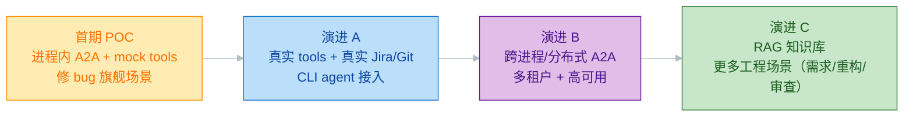

### 18.2 关键演进维度

| 维度 | 首期（POC） | 目标平台 | 升级方式 |
|------|------------|---------|---------|
| A2A 通信 | 进程内 EventBus | 跨进程 HTTP/JSON-RPC | 替换 EventBus 实现，接口不变 |
| Agent 运行时 | Agno + mock tools | Agno + CLI agent + 真实 tools | Toolkit/Adapter 内部替换 |
| 外部集成 | mock webhook | 真实 Jira/Git REST | 扩展 handler，接口稳定 |
| 部署 | 单进程 Docker Compose | 多副本 + 负载均衡 + Redis Relay | FastAPI 无状态化 |
| 租户 | 单 workspace | 多租户隔离 | 启用 workspace_id 过滤 |
| 知识 | Skills 静态注入 | + RAG 向量检索 | 启用 pgvector + Agno Knowledge |
| 场景 | 修 bug | + 需求/重构/审查 | 复用 Dev Agent 能力栈 |

### 18.3 POC 首期里程碑（工作量）

> 首期里程碑拆解。

| 里程碑 | 内容 | 累计人天 | 周数 |
|-------|------|---------|------|
| **M1 基础设施** | 基础设施、数据模型、A2A Mesh、实时 WS、可观测性 | 24 | 2 周 |
| **M2 核心编排** | 认证 RBAC、Super Admin & Team、项目导入、Jira webhook、Todo、Worker agents | 31 | 2.5 周 |
| **M3 前端** | 前端核心、用户视图、PM 视图 | 18 | 2 周 |
| **M4 集成** | 端到端集成验证 | 5 | 0.5 周 |

### 18.4 首期成功标准

| 标准 | 验收 |
|------|------|
| 端到端可演示 | CSV 导入 → 自动建 Team → webhook 触发 → 修复 → 提 PR 全流程跑通 |
| 人机回路有效 | Todo 阻塞 → 人处理 → 自动恢复可重复演示 |
| 可观测完整 | 每次运行在 Jaeger 可见完整 trace，Grafana 看板有数据 |
| 五大支柱验证 | 三层模型 / A2A 协作 / 生命周期 / 人机回路 / 可观测性均落地 |

---

# 附录

## 附录 A · 接口与字段细节（技术下钻）

### A.1 A2A 核心结构字段

**AgentMessage**：id、from_agent、to_agent(可空=广播)、message_type(request/response/notification/broadcast/error)、topic、payload、team_id、bug_task_id、trace_id、span_id、created_at

**AgentCard**：name(全局唯一)、display_name、type、capabilities[]、scope_affinity[]、input_schema、output_schema、status(idle/busy/offline/error)、description、is_system

**EventBus 方法**：`publish(topic, message)`、`subscribe(topic, handler)`、`unsubscribe(sub)`、`request(to_agent, payload, timeout=30)`、`broadcast(topic, payload)`、`stream(to_agent, payload)`、`persist(message)`

### A.2 主要数据表字段（摘要）

> 本附录仅列关键业务字段 DDL（类型、约束、索引）定义。

| 表 | 关键业务字段 |
|----|-------------|
| users | name、email(唯一)、role、jira_user_id、git_user_id、workspace_id |
| projects | name、schedule、scope(JSONB)、status、source_csv_path、imported_by、team_id |
| teams | project_id(唯一)、name、status、mode、idle_since、error_detail、agno_session_id |
| team_members | team_id、member_type、agent_id/user_id、role |
| agents | name(唯一)、type、capabilities、scope_affinity、status、is_system、config |
| todos | project_id、team_id、bug_task_id、assigned_to_user_id、created_by_agent_id、title、status、related_resource |
| bug_tasks | project_id、team_id、jira_bug_id、title、severity、status、current_step、current_agent_id、pr_url |
| webhook_events | source、external_id、event_type、payload、signature、processing_status、routed_to_team_id |
| agent_messages | from/to_agent_id、team_id、message_type、topic、payload、trace_id、span_id |

## 附录 B · 错误分类与传播

| 类型 | 代码 | 特征 | 处理策略 |
|------|------|------|---------|
| TRANSIENT | E100 | 网络抖动、临时不可用 | 自动重试（max 3，指数退避） |
| PERMANENT | E200 | 参数/权限/逻辑错误 | 不重试，标记 failed |
| TIMEOUT | E300 | 超时（默认 30s） | 重试 1 次，仍失败转 PERMANENT |
| OOM | E400 | 内存不足 | 直接 PERMANENT + 告警 |

**Agno 异常映射**：ModelAuthError→PERMANENT、ModelRateLimitError→TRANSIENT、ToolExecutionError→默认 TRANSIENT、TimeoutError→TIMEOUT、MemoryError→OOM。

**传播**：PM Agent 按 error_class 决定重试/跳过/创建 Todo；3 次重试仍失败 → Team failed；Super Admin 周期扫描 failed teams 生成复盘 Todo。

## 附录 C · Skills（知识注入）

- Skills 是 workspace 级共享资产，注入到 Agent 的 `instructions` 或 Team instructions。
- 存储为 `skills/*.md`（带 YAML frontmatter）。
- 分三类：
  - **领域理解类**（注入 dev agent）：bmc-firmware、uefi-boot-flow、tools-arch、lxca-service、lxce-firmware 等
  - **通用工程类**（注入 dev/fixbug）：code-review-checklist、git-workflow、testing-conventions、debugging-techniques
  - **跨 Team 共享类**：jira-bug-triage、git-conflict-resolution
- **关键**：所有 dev agent 共享同一工具集，component 差异仅通过 Skills + 领域数据体现。

## 附录 D · 质量与 UI 原则（一句话提及）

- **测试策略**：平台采用 TDD（Red-Green-Refactor），测试金字塔 70% 单元 / 20% 集成 / 10% E2E，核心模块行覆盖 ≥ 80% / 分支 ≥ 70%，CI 强制门槛。Mock 优先级 Fake > Stub > Mock > Spy。
- **UI 设计原则**：克制而精致（高信息密度 + 细腻动效 + 色彩克制，参照 Linear/Vercel）；全 token 化色彩 + 8pt grid；状态色系统统一。

### D.1 状态色系统

| 颜色 | 状态 | 含义 |
|------|------|------|
| 🟠 橙 | In Progress | agent 工作中 / todo 待处理 |
| 🔵 蓝 | Done | 任务完成 |
| 🟣 紫 | In Review | PR 已提交待审核 |
| ⚪ 灰 | Idle | agent 空闲 / Team 待触发 |
| 🔴 红 | Error | 失败 / 阻塞 |

### D.2 普通用户视图（线框）

```
┌──────────────────────────────────────────────────────────────┐
│  多 Agent 平台              [workspace ▼]   [user avatar]      │
├───────────────────────────┬──────────────────────────────────┤
│  📋 My Todos (3)          │  Agent Status (filter ▼)         │
│  🟠 解决合并冲突   BMC    │  🟠 dev-agent-bmc  analyzing      │
│  🔵 验证 PA 报告   TOOLS  │  ⚪ test-agent     idle           │
│  ⚪ 补充测试用例   UEFI   │  🔵 git-operator   done · PR #42  │
│  📜 History               │                                   │
├───────────────────────────┴──────────────────────────────────┤
│  💬 Chat with dev-agent-bmc                                   │
│  [输入框________________________________________] [发送]       │
└──────────────────────────────────────────────────────────────┘
```

### D.3 PM/Admin 视图（线框）

```
┌──────────────────────────────────────────────────────────────┐
│  多 Agent 平台 [PM]         [workspace ▼]   [PM avatar]        │
├───────────────────────────┬──────────────────────────────────┤
│  📋 Todos (5) 📥 Import   │  Teams Overview                  │
│  📊 Metrics               │  team-sustaining-26.3  🟠 working │
│   Teams: 3 active/1 idle  │    bug: BUG-999 · step: fixing    │
│   Bugs resolved: 47 (24h) │  team-sustaining-26.4  ⚪ idle    │
│   Avg fix: 8m32s          │  Recent Activity (跨 Team 时间线) │
│  🔍 Trace Explorer        │   [dev-bmc] analyzing BUG-999 1m  │
└───────────────────────────┴──────────────────────────────────┘
```

## 附录 E · 开放问题清单（待确认）

> 以下为撰写过程中发现的、需与你进一步确认的点。已按当前最合理假设撰写正文，确认后我会回填修订。

| # | 问题 | 当前假设（正文采用） | 备选项 |
|---|------|---------------------|--------|
| Q1 | LLM 默认接入点 | 正文写"可配置"，内网 / DashScope 二者皆可 | (a) 默认内网 internal-llm；(b) 默认 DashScope 云端；(c) 保持可配置不设默认 |
| Q2 | 平台正式产品名 | 正文用中性名"多 Agent 管理平台" | 是否需要正式品牌名？ |
| Q3 | 分布式 A2A 的目标时间点 | 列为演进 B，未定具体时间 | 是否需要把分布式化纳入首版（而非后续）？ |
| Q4 | CLI agent（Claude Code/Copilot）接入优先级 | 列为演进 A（首期后） | 是否需要在首期就并行接入真实 CLI agent？ |
| Q5 | 非 bug 场景（需求/重构/审查）排期 | 列为 P2 演进 C | 是否有场景需提前到首版？ |
| Q6 | PA-Tester 调度场景 | 标为 P1，按 project.schedule 触发 | 是否首期即需要定时 PA 测试演示？ |
| Q7 | 多租户启用时间 | 列为 P2，仅预留字段 | 是否有多团队隔离的近期需求？ |

---

## 文档版本历史

| 版本 | 日期 | 摘要 |
|------|------|------|
| v1.0 | 2026-06-23 | 平台级需求+设计文档；确立分布式 A2A 与可插拔运行时为目标架构，POC 为首期里程碑 |
